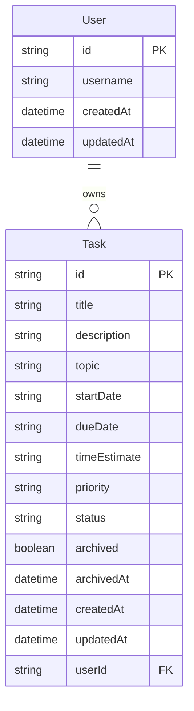

# Markdown document preparation

**User:** Anonymous  
**Created:** 8/3/2026 15:48:18  
**Updated:** 8/3/2026 15:57:22  
**Exported:** 8/3/2026 16:59:50  
**Link:** [https://chatgpt.com/g/g-p-6a6c6a7081f88191bedd443931229de8/c/6a709be8-a300-83ea-a723-69de982a604d](https://chatgpt.com/g/g-p-6a6c6a7081f88191bedd443931229de8/c/6a709be8-a300-83ea-a723-69de982a604d)  

## Prompt:
8/3/2026, 3:48:16 PM

[Attachment: image(15).png]

Okay now we need to prepare these documents as markdowns, please provide the code for each of the documents as markdowns, its all based on this whole project

## Response:
8/3/2026, 3:48:18 PM

> **Remembering**
>
>
> **Reviewed TaskFlow project configuration and package setup**
>
> 
>
> **Planning the documentation**
>
> I’m preparing a compact project handoff covering architecture, routes, data relationships, local setup, and the task lifecycle. I’m keeping implementation details accurate without exposing internal retrieval mechanics.
>
> **Planned the documentation**
>
> 
>
> **Building the handoff**
>
> I’m documenting the application’s actual structure, routes, data model, setup commands, and dependencies. I’m avoiding guessed versions where the project’s configuration doesn’t confirm them, so placeholders can be filled from local files.
>
> **Built the handoff**
>
> 
>
> Worked for 2m 36s

Create these three files in the **root of the repository**, next to `package.json`. The content reflects TaskFlow’s current fields, statuses, archive behaviour, overdue calculation, API-backed storage, and use of `lucide-react`. `page-calendar-polished.tsx`

Before submitting, run `node --version` and replace `22.x` in the third document with the exact version displayed on your computer.

## 1. `THIRD_PARTY_CODE.md`

````markdown
# Third-Party Code

## Overview

TaskFlow is built using open-source libraries and packages installed through the Node Package Manager (`npm`).

The exact installed versions are recorded in `package.json` and locked in `package-lock.json`.

## Application Dependencies

| Package | Purpose and reason for selection |
|---|---|
| `next` | Provides the web application framework, routing, API routes and production build system. It was selected because the project requires a Next.js application with both frontend and backend functionality. |
| `react` | Provides the component-based user interface used by TaskFlow. It was selected because it integrates directly with Next.js and supports reusable, state-driven UI components. |
| `react-dom` | Connects React components to the browser DOM. It is required for React applications running in a web browser. |
| `@prisma/client` | Provides the generated database client used by the API routes to read and modify users and tasks. It was selected because it provides type-safe database access. |
| `lucide-react` | Provides the icons used throughout the TaskFlow interface. It was selected because it offers accessible, consistent and lightweight React icons. |

## Development Dependencies

| Package | Purpose and reason for selection |
|---|---|
| `prisma` | Provides the Prisma command-line tools used to generate the Prisma client and synchronise the database schema with SQLite. |
| `typescript` | Adds static type checking to the project. It was selected to reduce runtime errors and make the application code easier to maintain. |
| `eslint` | Analyses the source code for common programming errors and style problems. It was selected to improve code quality and consistency. |
| `eslint-config-next` | Provides the official ESLint rules recommended for Next.js projects. |
| `@types/node` | Provides TypeScript type definitions for Node.js APIs used by the application and supporting scripts. |
| `@types/react` | Provides TypeScript type definitions for React. |
| `@types/react-dom` | Provides TypeScript type definitions for React DOM. |

## Database Technology

### SQLite

TaskFlow uses SQLite as its database.

SQLite was selected because TaskFlow is a local-first application and does not require a separately installed or hosted database server. The database is stored as a local file and is created automatically when the project is started.

### Prisma ORM

Prisma is used as the Object-Relational Mapper between the Next.js API routes and SQLite.

Prisma was selected because it provides:

- A clear database schema.
- Type-safe database queries.
- Automatic Prisma Client generation.
- Simple local database setup.
- Easy synchronisation through `prisma db push`.

## Testing

The project uses Node.js to execute the automated test runner through:

```bash
npm test
```

The command runs:

```bash
node scripts/run-tests.mjs
```

The test runner groups the project tests behind one command, as required by the project specification.

## Styling

TaskFlow primarily uses custom CSS stored in the project source files. No third-party user-interface component library is used for the layout or visual design.

## Package Version Reproducibility

`package-lock.json` must remain committed to the repository.

This file records the exact dependency versions used by the project so that running:

```bash
npm install
```

from a clean clone installs the same package versions.
````

---

## 2. `DATABASE_DESIGN.md`

````markdown
# Database Design

## Overview

TaskFlow uses a local SQLite database accessed through Prisma ORM.

The application contains two main database tables:

1. `User`
2. `Task`

The database supports a local user and the tasks belonging to that user.

## Entity Relationship Diagram



## User Table

The `User` table stores the local TaskFlow user.

| Field | Description |
|---|---|
| `id` | The unique identifier and primary key for the user. |
| `username` | The name entered by the user when TaskFlow is opened for the first time. |
| `createdAt` | The date and time at which the user was created. |
| `updatedAt` | The date and time at which the user was last updated. |

The username is stored so that the application can display the user's name and initials when the application is opened again.

TaskFlow is a local-first application and does not implement password-based authentication or online user accounts.

## Task Table

The `Task` table stores all active and archived tasks.

| Field | Description |
|---|---|
| `id` | The unique identifier and primary key for the task. |
| `title` | The task's short title. |
| `description` | A longer description of the work that must be completed. |
| `topic` | The project, course or topic to which the task belongs. |
| `startDate` | The date on which work on the task is expected to begin. |
| `dueDate` | The date by which the task should be completed. |
| `timeEstimate` | A user-entered estimate of how long the task will take. |
| `priority` | The importance of the task. The supported values are `Low`, `Medium` and `High`. |
| `status` | The task's current workflow status. |
| `archived` | Indicates whether the task is active or has been archived. |
| `archivedAt` | The date and time at which the task was archived. It is empty for active tasks. |
| `createdAt` | The date and time at which the task was created. |
| `updatedAt` | The date and time at which the task was last updated. |
| `userId` | A foreign key linking the task to its owner in the `User` table. |

## Task Status Values

TaskFlow uses three fixed task statuses:

| Stored value | Displayed value | Meaning |
|---|---|---|
| `todo` | To do | The task has not yet been started. |
| `progress` | In progress | The task is currently being worked on. |
| `done` | Completed | The task has been completed. |

A task normally moves through the following sequence:

```text
To do -> In progress -> Completed
```

The status is stored as part of the task rather than being represented by separate database tables.

## Relationship

The relationship between `User` and `Task` is a one-to-many relationship:

- One user can own zero or more tasks.
- Each task belongs to one user.
- `Task.userId` references `User.id`.

```text
User 1 -------- 0..* Task
```

## Archiving

Archived tasks are not moved into a separate archive table.

They remain in the `Task` table and are identified using the archive fields:

- `archived`
- `archivedAt`

This preserves the complete task information, including the status the task had when it was archived.

The application retrieves active tasks and archived tasks separately through its API routes.

## Overdue Tasks

Overdue is not stored as a separate task status or database field.

The application calculates whether a task is overdue using the following rules:

1. The task's due date is earlier than the current date.
2. The task's status is not `done`.

This prevents overdue information from becoming outdated in the database because it is recalculated whenever the application runs.

## Notifications

Dismissed overdue-notification identifiers are stored in the browser's local storage.

They are not stored in the SQLite database because dismissing a notification is a local interface preference rather than permanent task data.

## Database Location

The SQLite database is stored locally in the Prisma directory:

```text
prisma/dev.db
```

The database file is generated automatically and should not be treated as shared source code. The database structure is defined by:

```text
prisma/schema.prisma
```

A new developer can recreate the database from the schema by running:

```bash
npm run db:setup
```
````

---

## 3. `RUNNING_IT.md`

````markdown
# Running TaskFlow

## Requirements

The following software is required:

| Software | Version |
|---|---|
| Node.js | 22.x |
| npm | Installed with Node.js |
| Git | Any recent version |

No external database server is required because TaskFlow uses a local SQLite database.

To check the installed versions, run:

```bash
node --version
npm --version
git --version
```

## Starting from a Clean Clone

### 1. Clone the repository

```bash
git clone <REPOSITORY_URL>
```

Replace `<REPOSITORY_URL>` with the GitHub URL of the TaskFlow repository.

### 2. Enter the repository

```bash
cd SDP_Lab1
```

### 3. Install the packages

```bash
npm install
```

This installs the exact package versions recorded in `package-lock.json`.

### 4. Start the development server

```bash
npm run dev
```

The `predev` script automatically runs the database setup before the Next.js development server starts.

The database setup command:

1. Creates or updates the local SQLite database.
2. Creates the `User` and `Task` tables.
3. Generates the Prisma Client.

Once the server has started, open:

```text
http://localhost:3000
```

in a web browser.

## Running the Automated Tests

Run all automated tests using:

```bash
npm test
```

This command executes:

```bash
node scripts/run-tests.mjs
```

All project tests are therefore accessible through one documented command.

## Checking Code Quality

Run ESLint using:

```bash
npm run lint
```

The command reports TypeScript, React and Next.js linting problems.

## Running a Production Build

### 1. Build the application

```bash
npm run build
```

The `prebuild` script automatically prepares the database and generates the Prisma Client before the production build begins.

### 2. Start the production server

```bash
npm start
```

The production application will be available at:

```text
http://localhost:3000
```

## Manual Database Setup

Database setup normally runs automatically before development and production builds.

It can also be run manually using:

```bash
npm run db:setup
```

This executes:

```bash
prisma db push && prisma generate
```

`prisma db push` synchronises the SQLite database with the Prisma schema.

`prisma generate` generates the Prisma Client used by the Next.js API routes.

## Available npm Commands

| Command | Purpose |
|---|---|
| `npm run dev` | Sets up the database and starts the development server. |
| `npm run build` | Sets up the database and creates an optimised production build. |
| `npm start` | Starts the previously built production application. |
| `npm test` | Runs all automated project tests. |
| `npm run lint` | Runs ESLint over the project source code. |
| `npm run db:setup` | Synchronises the database schema and generates Prisma Client. |

## Relevant package.json Scripts

The repository contains the following scripts:

```json
{
  "scripts": {
    "dev": "next dev",
    "build": "next build",
    "start": "next start",
    "test": "node scripts/run-tests.mjs",
    "db:setup": "prisma db push && prisma generate",
    "predev": "npm run db:setup",
    "prebuild": "npm run db:setup",
    "lint": "eslint"
  }
}
```

The `predev` and `prebuild` scripts are npm lifecycle scripts. They run automatically before `dev` and `build`, so a developer does not need to enter separate Prisma commands after cloning the repository.

## Local Database

TaskFlow stores its data in a local SQLite database:

```text
prisma/dev.db
```

Each cloned copy of the repository creates its own database. This means that users do not share tasks with other installations.

## Resetting the Local Database

To reset all locally stored users and tasks:

1. Stop the running application.
2. Delete:

```text
prisma/dev.db
```

3. Recreate the database:

```bash
npm run db:setup
```

Deleting this file permanently removes the locally stored user and tasks.

## Clean-Clone Command Summary

The complete command sequence required to run TaskFlow from a clean clone is:

```bash
git clone <REPOSITORY_URL>
cd SDP_Lab1
npm install
npm run dev
```

The complete command sequence required to test TaskFlow is:

```bash
npm install
npm test
```

The complete command sequence required to run the production version is:

```bash
npm install
npm run build
npm start
```
````

Also add links to these files near the bottom of your main `README.md`:

```markdown
## Project Documentation

- [Third-Party Code](THIRD_PARTY_CODE.md)
- [Database Design](DATABASE_DESIGN.md)
- [Running the Application](RUNNING_IT.md)
```


---
Powered by [ChatGPT Exporter](https://www.chatgptexporter.com)