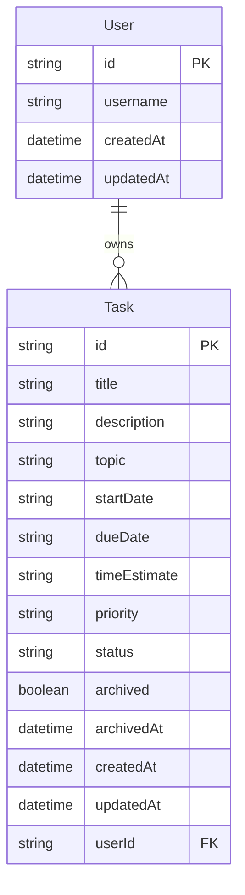

# Database Design

## Overview

TaskFlow uses a local SQLite database accessed through Prisma ORM.

The application contains two main database tables:

1. `User`
2. `Task`

The database supports a local user and the tasks belonging to that user.

## Entity Relationship Diagram



## User Table

The `User` table stores the local TaskFlow user.

| Field | Description |
|---|---|
| `id` | The unique identifier and primary key for the user. |
| `username` | The name entered by the user when TaskFlow is opened for the first time. |
| `createdAt` | The date and time at which the user was created. |
| `updatedAt` | The date and time at which the user was last updated. |

The username is stored so that the application can display the user's name and initials when the application is opened again.

TaskFlow is a local-first application and does not implement password-based authentication or online user accounts.

## Task Table

The `Task` table stores all active and archived tasks.

| Field | Description |
|---|---|
| `id` | The unique identifier and primary key for the task. |
| `title` | The task's short title. |
| `description` | A longer description of the work that must be completed. |
| `topic` | The project, course or topic to which the task belongs. |
| `startDate` | The date on which work on the task is expected to begin. |
| `dueDate` | The date by which the task should be completed. |
| `timeEstimate` | A user-entered estimate of how long the task will take. |
| `priority` | The importance of the task. The supported values are `Low`, `Medium` and `High`. |
| `status` | The task's current workflow status. |
| `archived` | Indicates whether the task is active or has been archived. |
| `archivedAt` | The date and time at which the task was archived. It is empty for active tasks. |
| `createdAt` | The date and time at which the task was created. |
| `updatedAt` | The date and time at which the task was last updated. |
| `userId` | A foreign key linking the task to its owner in the `User` table. |

## Task Status Values

TaskFlow uses three fixed task statuses:

| Stored value | Displayed value | Meaning |
|---|---|---|
| `todo` | To do | The task has not yet been started. |
| `progress` | In progress | The task is currently being worked on. |
| `done` | Completed | The task has been completed. |

A task normally moves through the following sequence:

```text
To do -> In progress -> Completed
```

The status is stored as part of the task rather than being represented by separate database tables.

## Relationship

The relationship between `User` and `Task` is a one-to-many relationship:

- One user can own zero or more tasks.
- Each task belongs to one user.
- `Task.userId` references `User.id`.

```text
User 1 -------- 0..* Task
```

## Archiving

Archived tasks are not moved into a separate archive table.

They remain in the `Task` table and are identified using the archive fields:

- `archived`
- `archivedAt`

This preserves the complete task information, including the status the task had when it was archived.

The application retrieves active tasks and archived tasks separately through its API routes.

## Overdue Tasks

Overdue is not stored as a separate task status or database field.

The application calculates whether a task is overdue using the following rules:

1. The task's due date is earlier than the current date.
2. The task's status is not `done`.

This prevents overdue information from becoming outdated in the database because it is recalculated whenever the application runs.

## Notifications

Dismissed overdue-notification identifiers are stored in the browser's local storage.

They are not stored in the SQLite database because dismissing a notification is a local interface preference rather than permanent task data.

## Database Location

The SQLite database is stored locally in the Prisma directory:

```text
prisma/dev.db
```

The database file is generated automatically and should not be treated as shared source code. The database structure is defined by:

```text
prisma/schema.prisma
```

A new developer can recreate the database from the schema by running:

```bash
npm run db:setup
```

## AI Declaration
-The preceding document was generated with: OpenAI[ChatGPT-5.6 Sol]